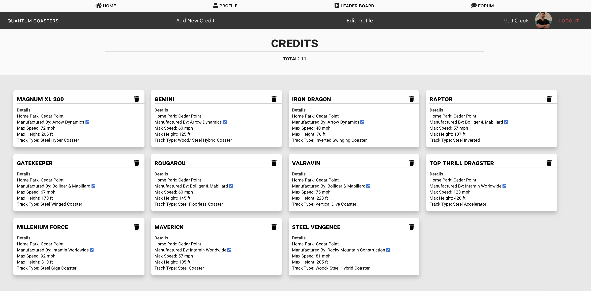
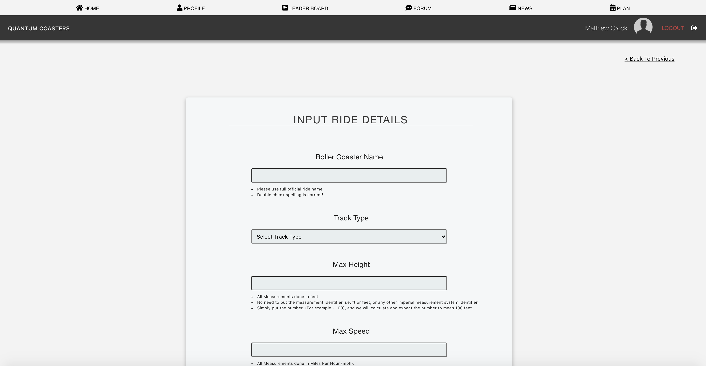

# Quantum Coasters

## Setup

1. `git clone git@github.com:MattCrook/quantum-front-end-capstone.git`
1. `cd` into the directory it creates
   1. To run locally using `json-server` do the following steps:
   2. `mkdir api`
   3. Cd in api directory and `touch db.json`
   4. Populate the mock database with dummy data found [here](https://gist.github.com/MattCrook/57da766ddee58d9535ebb9beb910e0c8)
   5. Install [json-server](https://www.npmjs.com/package/json-server): `npm install -g json-server`
   6. `npm install` to build dependencies
   7. `npm run dev` to run the app in the development mode
   8. `json-server -p 8200 -w api/database.json`...or I've set up a development server, so you can run `npm run dev-server` to run json-server.
   9.  Open [http://localhost:3000](http://localhost:3000) to view it in the browser.
2.  Or, preferably, run with the **QuantumAPI**.
    1.  To see instructions, click [here](https://github.com/MattCrook/quantumapp-api).

## Overview

This is an app for rollercoaster enthusiasts and the general public to meet in one place, look up, share, upload data, and talk to other enthusiasts. One of the main features of Quantum Coasters is to let users record their coaster “credits”, where one "credit" equals one roller coaster ridden. A key feature of this application is that if the rollercoaster does not exist in the Database, the user can create a new entry which in turn will create a new resource in the database that will allow all users to select from.
Quantum contains the following features and pages users will engage with:

### 1) Landing Page
Upon first arrival to Quantum Coasters, users will land on the below page and be prompted to sign in or register.

### 2) Login/ Register
Quantum Coasters uses [Auth0](https://auth0.com/) for its authentication and authorization security services. Once validating credentials is successful, the user wll be redirected back to the Quantum site and logged in to their account. Auth0 will pass the user an access token granting them permission to access the scopes and views relative to their account, as well as be able to perform CRUD on their own resources as the backend API will be expecting the access token, as well as check the scopes and permissions of the user to authorize them to perform those actions.

#### Added Security

For a returning user, they are asked to confirm their email they logged in with. This checks against Auth0, and also checks against Django Rest Auth to confirm the email entered and used to login, matches between the two auth services and matches the email attached to the session token used by Django as a unique identifier for the user.
* This step is critical for the app and added security, as it accepts the JWT token from Auth0, authenticates the user, then matches the user in the Django API side of the app so that Django is aware of the authenticsted user and can act and give permissions appropriatly.

### 3) Home
Once the user successfully authenticates, Auth0 will rediect them back to the home page of Quantum Coasters, where they will now have access to the many options to navigate to, including recording their credits!

### 4) Profile
Navigating to the profile page, the user will see a list of credits for which they have recorded, as well as have options to add a new credit and edit their profile.

Once the user selects the park in which the ride is located, they are brought to a list of roller coasters in that park where they can add/ record it is a credit.

#### Delete Profile
User has ability, if they wish, to delete their account with Quantum Coasters. Doing so will delete any and all information the user has saved within the Quantum Coasters system. 

#### Edit Profile
User can edit profile info, see a total of credits to which they have, and upload a profile picture to display in other various places throughout the application.

### 5) Add New RollerCoaster
One key feature of this app is that the data provided is constantly being updated with new rides, as Quantum Coasters allows users to add to the repertoire if they cannot find the rollercoaster they are looking to record. This ensures the database is constantly being updated to include more rides from around the world.
* Once the user completes the form and it is validated, the roller coaster will then be available to select as an added credit.

### 6) Live Leaderboard
Users can see where they rank among other coaster enthusists from around the world by navigating to the leaderboard that Quantum Coasters provides.

### 7) Forum 
Users can also engage with other users of the app and coaster enthusiasts alike, where they can discuss their affinity for roller coasters and share their experiences.

### 8) News
Custom Web Scraper pulls in the latest news from around the country and world so you as a user are always up to date on what is going on in the roller coaster world. 
* The user may also apply to write blog posts and have them published exclusively here on Quantum Coasters, for the community of coaster loving fans to read and interact with. This is done so with the purpose of creating a truly unique, rewarding, and educational experience reserved only for those using the Quantum Coasters app.

## Technologies Used
This project utilizes the following:
* React
* React Context API
* React Router DOM
* React Router
* React Confirm Alert
* Auth0
* JWT for Authentication
* React Testing Library
* Jest
* Deployed with Zeit/Now/Vercel
* Github Actions
* Material UI
* Semantic UI
* Webpack
* DbDiagram
* Vercel

## Skills Utilized
The skills and concepts utilized to complete this project included the following:

1. React: hooks, state, props, routes
2. API calls with: POST, PUT, PATCH, DELETE, and GET (with expand, embed)
3. Javascript: functions, objects, arrays, mapping
4. Persistent data storage with JSON Server
5. Github Scrum workflow
6. CSS styling
7. Modular code
8. Semantic HTML
9. Testing with Jest/ React Testing Library
10. Using and integrating with 3rd party service for Authentication
11. Pure functional components
12. Flow and state management through the React Context API
13. Building A CI/ CD pipeline
14. Github actions for auto deploys to Vercel, running  tests, linting, prettier
15. Using conventional commit logs

<!-- ## Database Diagram
 -->

## Deployed Application Link
[Quantum Coasters](https://quantum-application-71iyalov8.now.sh/)
