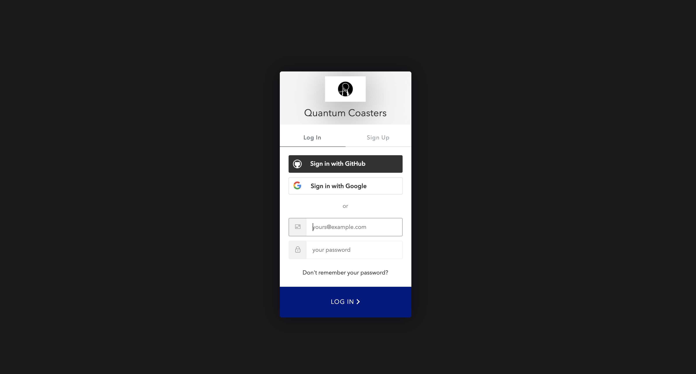

## Login/ Register
Quantum Coasters uses [Auth0](https://auth0.com/) for its authentication and authorization security services. Once validating credentials is successful, the user wll be redirected back to the Quantum site and logged in to their account. Auth0 will pass the user an access token granting them permission to access the scopes and views relative to their account, as well as be able to perform CRUD on their own resources as the backend API will be expecting the access token, as well as check the scopes and permissions of the user to authorize them to perform those actions.

#### Added Security

For a returning user, they are asked to confirm their email they logged in with. This checks against Auth0, and also checks against Django Rest Auth to confirm the email entered and used to login, matches between the two auth services and matches the email attached to the session token used by Django as a unique identifier for the user.
* This step is critical for the app and added security, as it accepts the JWT token from Auth0, authenticates the user, then matches the user in the Django API side of the app so that Django is aware of the authenticsted user and can act and give permissions appropriatly.
