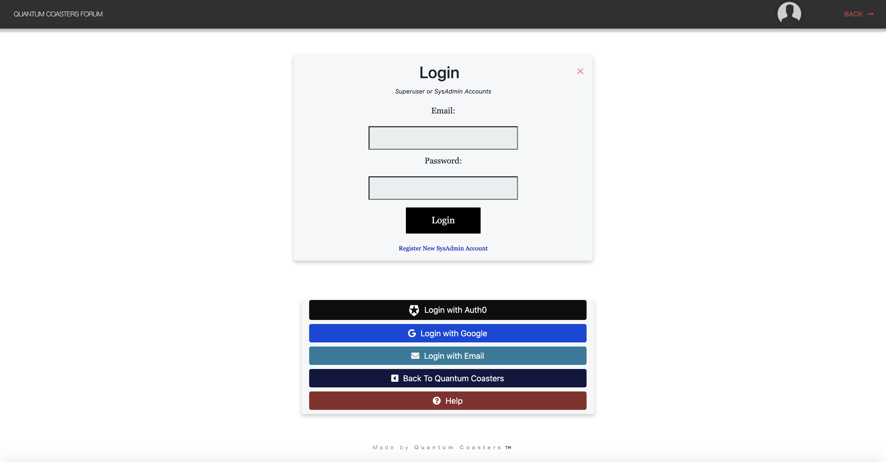
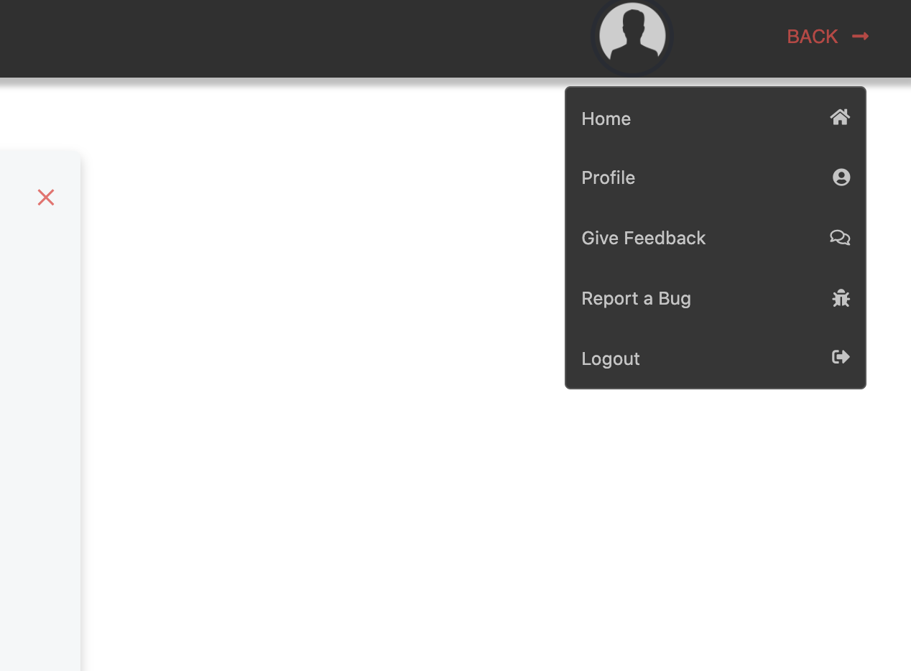
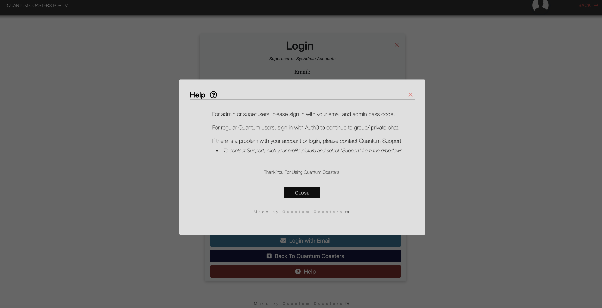
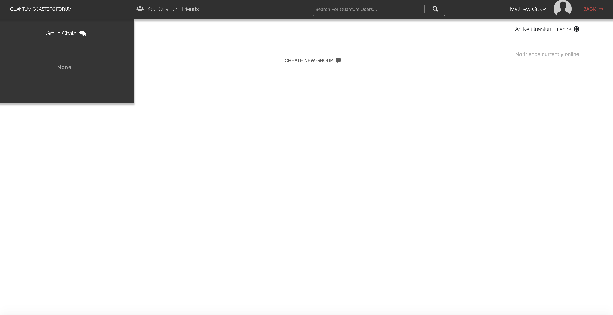
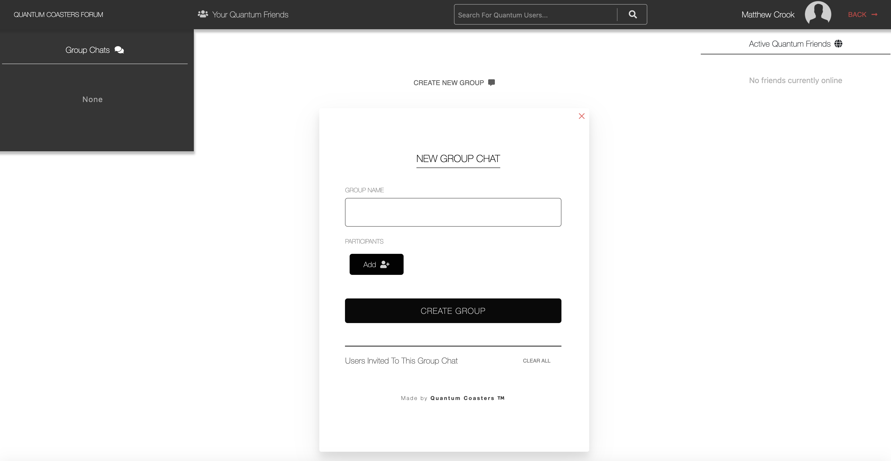
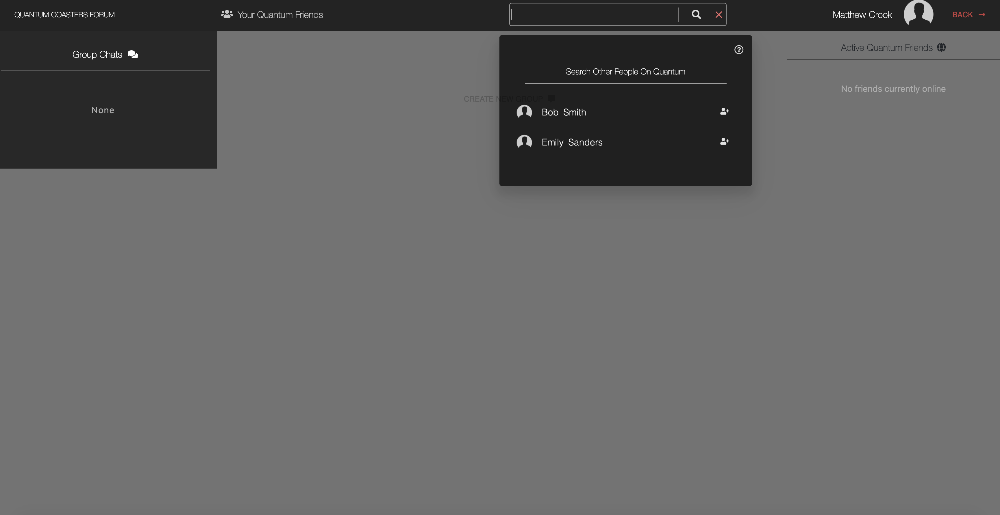
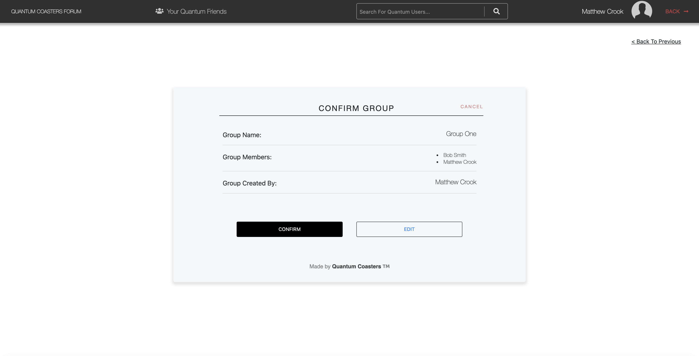
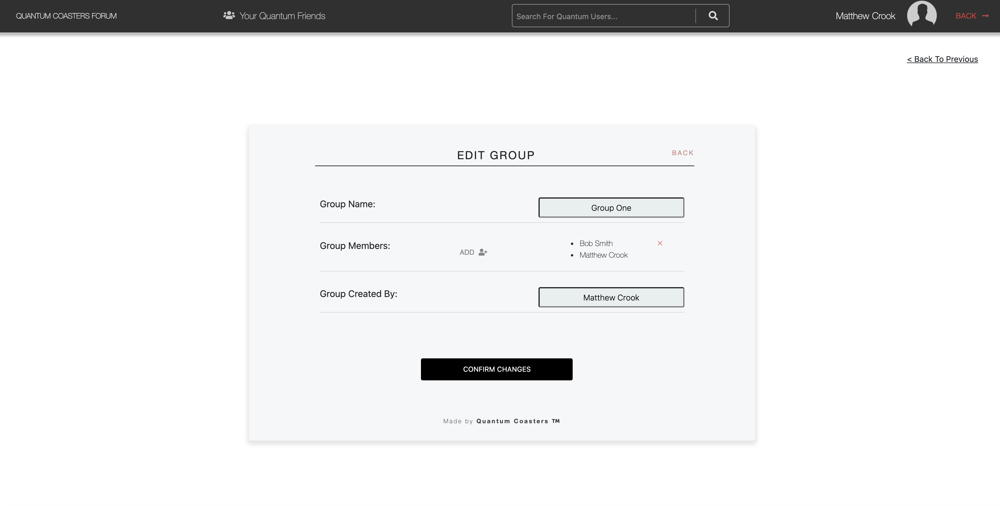
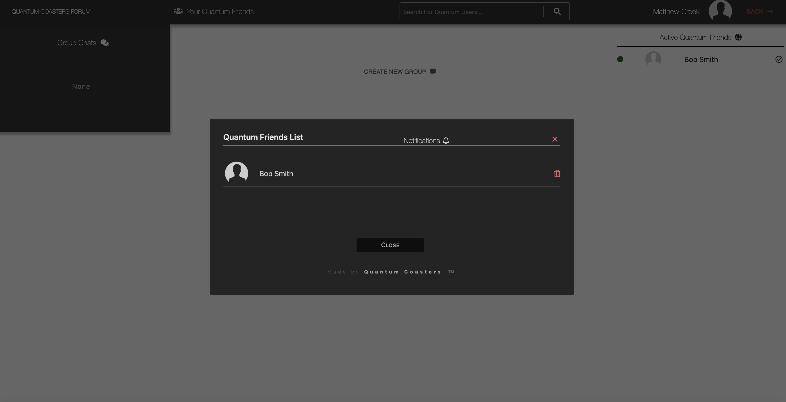
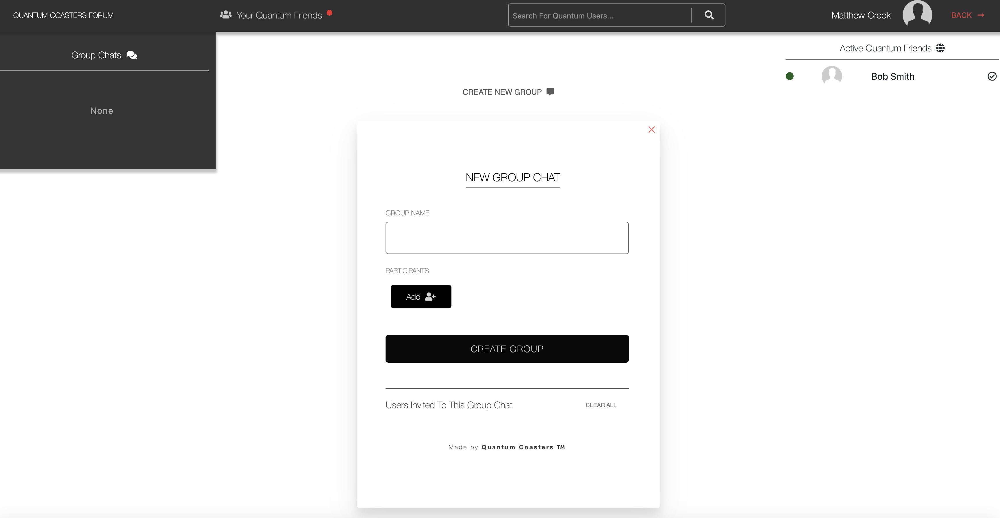

# Qauntum Forum

The Quantum Forum was created as a way for coaster enthusiasts and members using the Quantum Coasters application to have a way to socialize with each other, share information, and overall partake in being a member of the coaster community.

The Quantum Forum is comprised of three sections:
* General
* Group Chat 
* Private Chat

## General

The General section is just as it sounds, a general forum where any and all users can post. 

## Group Chat

Navigating to the group chat section, the user actually exits the Quantum Coasters client and enters another application within the over aching architecture. This is not noticeable, as the user does not have to re-authenticate due to being taken through an OAuth2 flow. Once they have authenticated with the main client, the user can experience a smooth transition between authenticating with the various micro services.
* Should the user's session expire, or be logged out, they will be promted to re-authenticate in order to enter either the Forum, or the main client.

There are also the similar options to the main client in the user's dropdown by clicking their profile picture, and well as *help* options for more detailed info in the event the user is facing an issue.

  *  

<!--  -->

#### Main Group Chat Landing Page

If the user selects *Group Chat*, they are brought to their group chat landing page, where they can:
* Create a new group/channel
* Select from existing channels/ chats
* See which friends are currently online or using Quantum Coasters
* View a list of friends they have, as well as check any notifications the user might have (such as friend requests).
* Search Quantum Coasters for users, to which send a friend request.

#### Creating a Group Chat
To start a new group, the user should fill out the new group chat form. For every person added to the group, their name will show up in the "Users Added to Group Chat" section of the form. 
* *Important to note, in order to add people to the group chat, the user must first be friends with that person*.
  * If the user needs to send a friend request, they can search in the nav search bar, and click the add user icon.
  * 

Once the group members have been selected, the user can review the information that will be used to create the new group, and have the option to **confirm**, creating the new group with all the specified members, or **edit**, taking them back to a view where they can change the name, and add or remove members from the group.

If at any point the user wishes to discard the group, they can click *cancel* and it will throw away all changes made and discard the group.

#### Quantum Friends

By selecting "Your Quantum Friends", the user can view a list of Quantum users that they are friends with, and can add to group chats, or private message.

In addition, if the user has a pending notification, which is read off of the status code of the request, they will see a red notification dot next to "Your Quantum Fiends", to which they can navigate to view the notification.

In regards to a friend request, there are three action items to choose from:
* Accept
* Decline
* Block

These three options have different behaviors, as their name suggests, and are in place to ensure the user has a good experience.

