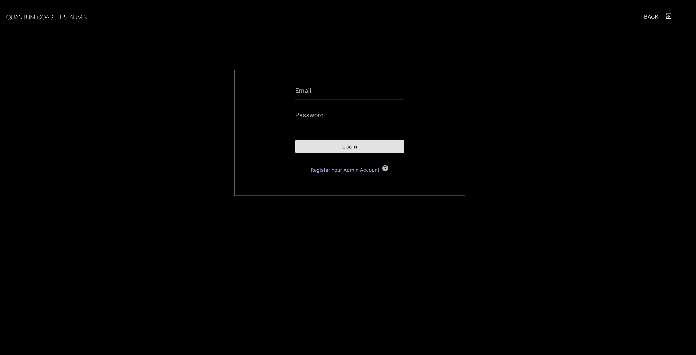
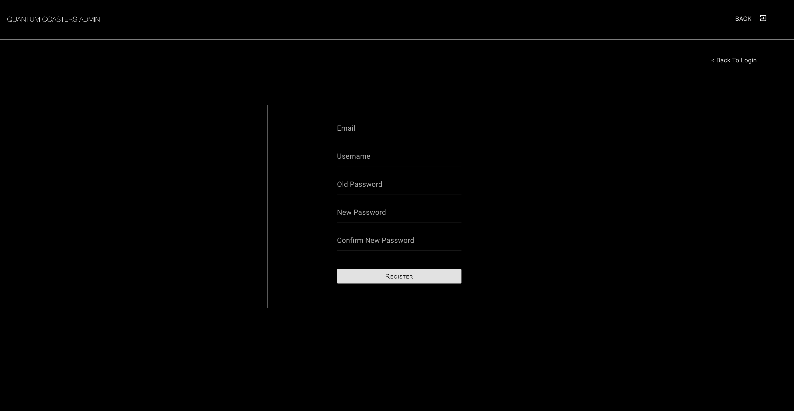
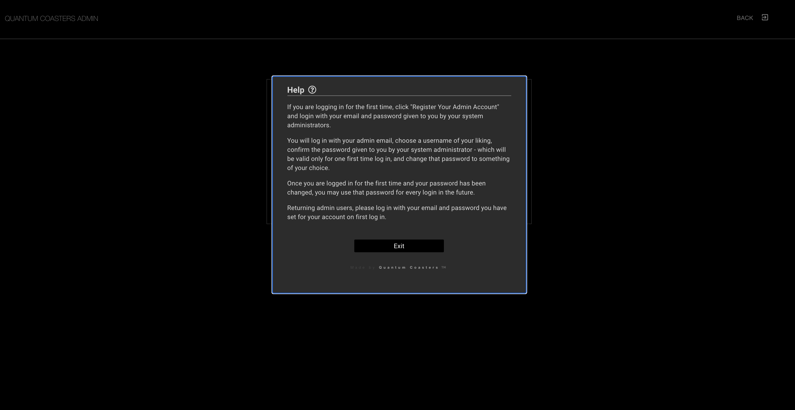
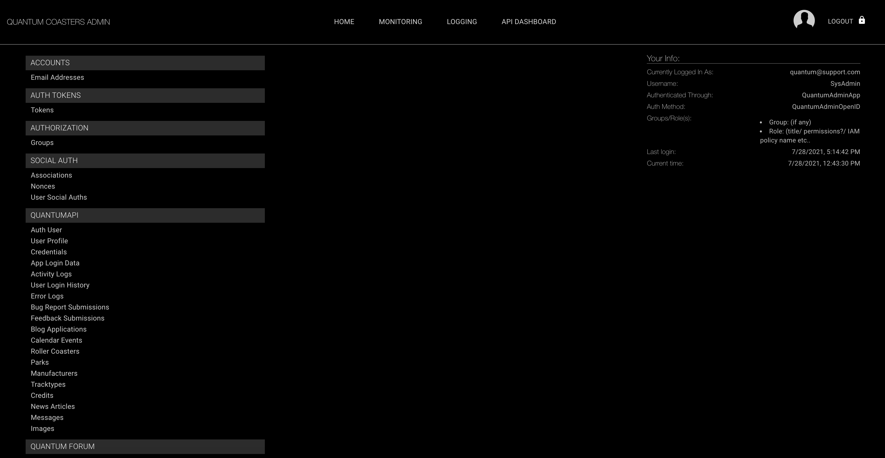
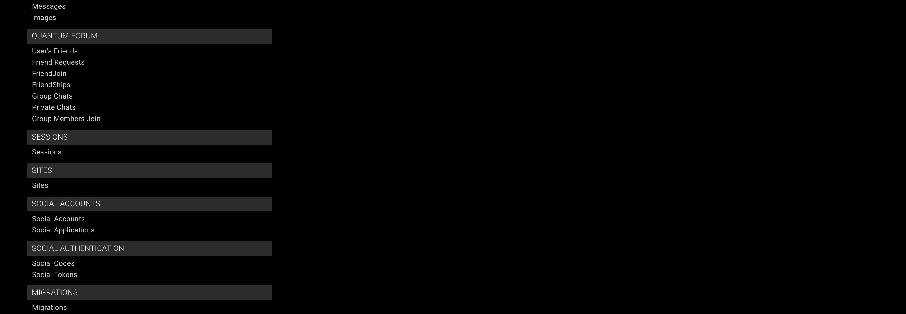
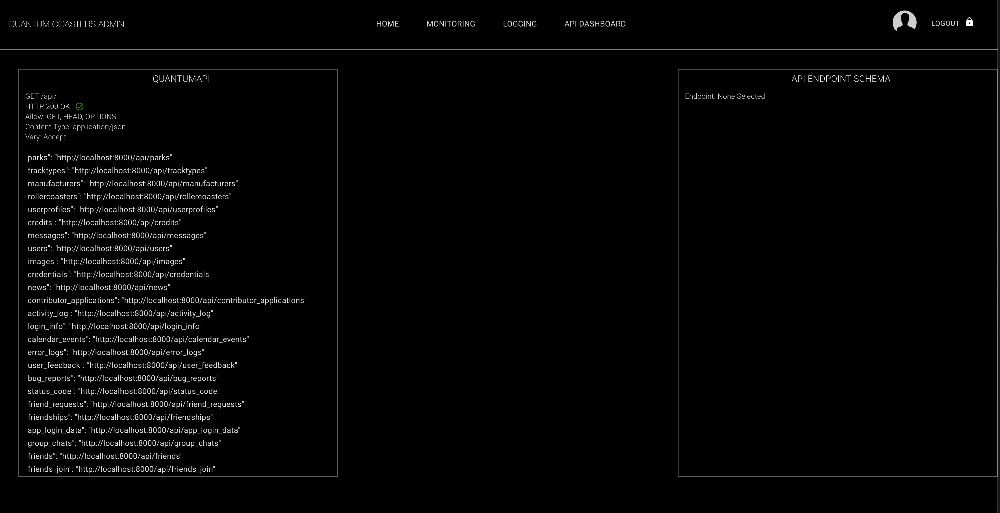

# Quantum Coasters Admin

The Quantum Coasters Admin/ Management application provides key insights and dashboards for admin users to utilize for monitoring, logging, traffic, scaling, performance, and security across all of Quantum Coasters.

#### Admin Users

A system administrator must first set up an admin user's account to be able to log into Quantum Admin. They will be given a temporary password, which can be used once to log in, then change their password.

* Once logged in and registered in the system, the user not only has rights to Quantum Admin, but Quantum Admin also provides access to the Django Admin view, and the Django Rest Admin view as well.

##### Login

##### Register

##### Help Modal for Further Instructions

## Admin Views

There are many various dashboards and visualizations provided for observability, to ensure the Quantum Coasters is keeping the highest redundancy possible and keep the system reliable.

Quantum Admin provides access to:

* **Monitoring**
  * Performance
  * Error Logs
  * API Endpoints and traffic
  * Security and Authentication
  * User logs and in-app activity
* **API Dashboard**
  * Visualization of all API endpoints
  * Their data and structure
  * Django Rest Admin
* **User Management**
  * Visualization of all data pertaining to user, across all tables in the database
  * Very useful to find all data pertaining to a user rather than SQL or hitting multiple endpoints from the frontend.
* **Key Metrics**
  * Track user habits
  * What parts of the app are the most used
  * What parts of the app fail the most
  * Logins, login attempts, and failed logins

***Admin Application is still under development. Full app coming soon.***

## Home Dashboard

## API Dashboard

