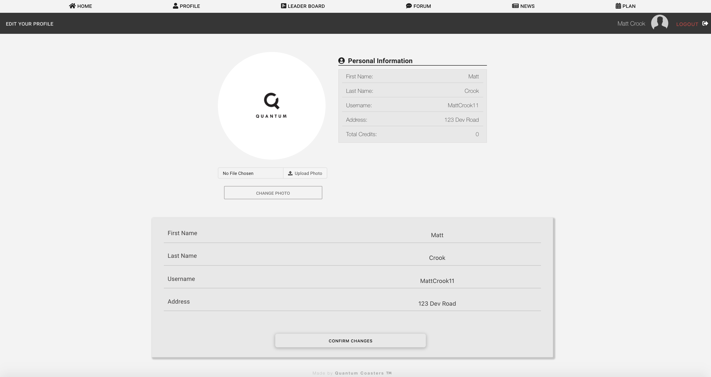
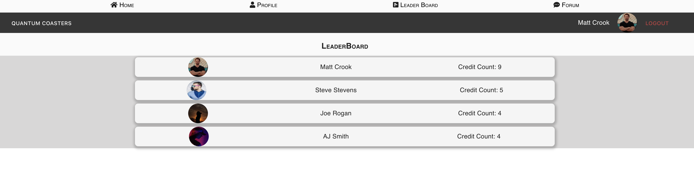

# Quantum Coasters Main Client

## Home
Once the user successfully authenticates, the third party identity provider will rediect them back to the home page of Quantum Coasters, where they will now have access to the many options to navigate to, including recording their credits!

* From the Home page, user may also click on their profile picture to expose additional options to perform actions.

* These include:
  * Django Admin Dashboard - if user has appropriate role and permissions to view the admin dashboard.
  * Option to navigate to the edit profile page.
  * Option to submit either feedback, or a bug they've encountered to Quantum Support. This is useful for constructive feedback regarding user experience and what Quantum can do to improve, as well as making support aware of active issues surrounding functionality of the application.
    * 
    * 

## Profile
Navigating to the profile page, the user will see a list of credits for which they have recorded, as well as have options to add a new credit and edit their profile.
* They can choose between three different views
  * All credits
  * List of credits by Ride
  * List of credits by Park

Once the user selects the park in which the ride is located, they are brought to a list of roller coasters in that park where they can add/ record it is a credit.

### Edit Profile
User can edit profile info, see a total of credits to which they have, and upload a profile picture to display in other various places throughout the application.

### Delete Profile
User has ability, if they wish, to delete their account with Quantum Coasters. Doing so will delete any and all information the user has saved within the Quantum Coasters system.

## Add New RollerCoaster
One key feature of this application is that the data provided is constantly being updated with new rides, as Quantum Coasters allows users to add to the repertoire if they cannot find the rollercoaster they are looking to record. This ensures the database is constantly being updated to include more rides from around the world.
* Once the user completes the form and it is validated, the roller coaster will then be available to select as an added credit.

#### Adding Bulk Rides Submission
If the user wishes to add more than one ride/ roller coaster at a time, there is an option to bulk add rides to a given park. 
* This is convienient when creating there is a newly added theme park to choose from, and the park does not have complete data regarding rides it contains.

First, the user is prompted to select a park for which to bulk add rides, then they may fill out the form for each ride they would like to add. Each ride they add will add to the list for the bulk submission, and once they are done they can review thier submission, then confirm to submit a bulk add ride request.

This option encourages only to be used when adding more than one ride, as the option to review the user's submission will only show if there is more than one ride added to the submission form. 

User can preview the data they've entered, ensure it is correct, then confirm to submit the bulk add ride form. Once it is processed, the new rides/ rollercoasters will be available to select from to record coaster credits.

## News
Custom Web Scraper pulls in the latest news from around the country and world so you as a user are always up to date on what is going on in the roller coaster world.

* The user may also apply to write blog posts and have them published exclusively here on Quantum Coasters, for the community of coaster loving fans to read and interact with. This is done so with the purpose of creating a truly unique, rewarding, and educational experience reserved only for those using the Quantum Coasters app.

* 

## Plan
Custom calendar to plan and record events. Plan your next theme park visit, set reminders, or just this as your personal calendar to keep track of everything that you have going on!
* *Google calendar integration coming soon*.

* The Quantum Calendar allows user to add events, edit events, delete events, set reminders, and will show any events scheduled in the next 5 days relative to the current day for the user in the left side bar.
* The calendar day block will show a indicator inside the block if there is an event scheduled for that day, allowing user easy navigation as to which days of the month they have an event scheduled.
* Calendar can be cycled through months in order, or filtered by years or months for easy navigation if user wishes to look back at previous months, or look into the future.

* 
* 

## Quantum Forum
Users can also engage with other users of the app and coaster enthusiasts alike, where they can discuss their affinity for roller coasters and share their experiences.
* Includes utilizing *websockets* for a live chat/ instant message system, plus ability to create chat groups or channels, and create sub forums.
    * These are brand new features, and include the ability to invite friends, send friend requests, and overall socialize with other users on the app.
  
  * ***To see the Quantum Forum application in more detail, click [here](Forum.md)***.

## Live Leaderboard
Users can see where they rank among other coaster enthusiasts from around the world by navigating to the leaderboard that Quantum Coasters provides.

***Section currently under re-design and update.***
